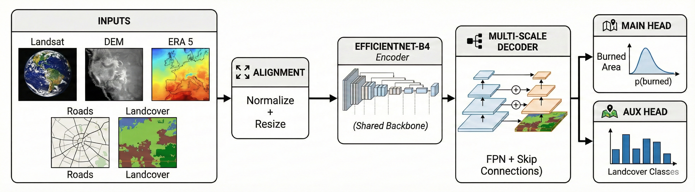

# WildFire

> Multimodal wildfire burned-area prediction from pre-fire satellite, terrain, weather, and ignition data.


WildFire is a research-focused deep learning project that estimates wildfire burned area using only information available before the fire fully develops. The repository compares a Sentinel-only baseline against a multimodal segmentation pipeline that fuses Sentinel-2, Landsat, DEM, ERA5 weather, infrastructure context, and ignition priors for fire events in Piedmont, Italy.

This repository is the cleaned, portfolio-ready version of the project: code is organized by model family, experiment outputs are grouped under `docs/`, and analysis scripts point to stable project-relative paths.

## Project Snapshot

- Problem: predict final burned-area masks from pre-fire observations.
- Core task: binary semantic segmentation of burned area.
- Main comparison: Sentinel-only baseline vs multimodal fusion model.
- Engineering focus: reproducible experimentation on limited hardware.
- Context: academic computer vision and geospatial AI project.

## Key Outcomes

- Multimodal model validation performance at best threshold (`0.95`):
  - IoU: `0.4026`
  - F1: `0.5741`
  - Precision: `0.5761`
  - Recall: `0.5722`
- Baseline validation performance at best threshold (`0.95`):
  - IoU: `0.1515`
  - F1: `0.2632`
- Auxiliary-task case study:
  - Mean delta IoU vs previous model: `+0.0514`
  - Win rate across samples: `30.7%`
- Modality ablation:
  - Full multimodal setup clearly outperforms Sentinel-only and most ablated variants.

Source artifacts:
- `docs/experiments/model-comparison/comparison_metrics.csv`
- `docs/experiments/modality-ablation/ablation_results.csv`
- `docs/case-studies/auxiliary-impact/report/summary.md`

## Model Overview

### Baseline

- Architecture: U-Net style burned-area segmentation
- Input: Sentinel-2 only
- Encoder: ResNet-34
- Purpose: strong reference model for comparison

### Multimodal Model

- Architecture: `MultiModalFPN`
- Encoder: EfficientNet-B4
- Inputs:
  - Sentinel-2 imagery
  - Landsat imagery
  - DEM and infrastructure rasters
  - ERA5 raster and tabular weather features
  - ignition priors
- Purpose: improve burned-area prediction through feature-level multimodal fusion

### Multimodal + Auxiliary Variant

- Adds auxiliary land-cover supervision during training
- Used for qualitative case studies and post-hoc evaluation
- Helps analyze where extra semantic context improves prediction quality

## Architecture



## Repository Structure

```text
WildFire/
├── README.md
├── requirements.txt
├── data/
│   ├── fire_*/
│   └── geojson/
├── docs/
│   ├── architecture/
│   ├── exploratory-analysis/
│   ├── experiments/
│   │   ├── modality-ablation/
│   │   └── model-comparison/
│   ├── case-studies/
│   │   ├── auxiliary-impact/
│   │   ├── inference-report/
│   │   ├── landcover-demo/
│   │   └── postprocess/
│   ├── figures/
│   │   └── slide-deck/
│   └── summaries/
├── inference/
│   ├── compare_baseline_vs_multimodal.py
│   ├── deploy_inference.py
│   ├── inference_2.py
│   └── inference_map.py
└── src/
    ├── analysis/
    ├── baseline_singlemodal/
    ├── multimodal/
    └── multimodal_auxiliary/
```

## Getting Started

### 1. Install dependencies

```bash
python -m venv .venv
source .venv/bin/activate
pip install -r requirements.txt
```

### 2. Expected data layout

The repository expects:

- fire samples inside `data/fire_*`
- vector metadata inside `data/geojson/`

Large checkpoints and generated outputs are intentionally ignored by Git.

### 3. Run core workflows

Train the multimodal model:

```bash
python src/multimodal/main.py
```

Train the baseline model:

```bash
python src/baseline_singlemodal/main.py
```

Generate comparison artifacts:

```bash
python inference/compare_baseline_vs_multimodal.py
python src/analysis/modality_ablation_quick.py
python src/multimodal_auxiliary/inference_report.py
```

Generate qualitative figures:

```bash
python inference/deploy_inference.py
python src/analysis/make_qualitative_panels.py
python src/analysis/plot_threshold_sweep.py
python src/analysis/export_slide_table.py
```

## Documentation Map

- Exploratory figures: `docs/exploratory-analysis/`
- Model comparison tables and charts: `docs/experiments/model-comparison/`
- Modality ablation results: `docs/experiments/modality-ablation/`
- Auxiliary model analysis: `docs/case-studies/auxiliary-impact/`
- Validation diagnostics: `docs/case-studies/inference-report/`
- Presentation-ready figures: `docs/figures/slide-deck/`

## Why This Repo Is Worth Reading

- It tackles a real geospatial prediction problem with a measurable baseline-to-multimodal uplift.
- It combines remote sensing, computer vision, segmentation, and multimodal fusion in one project.
- It includes ablation studies, qualitative analysis, and diagnostic reporting rather than only a single training script.
- It has been reorganized so readers can move from problem statement to model code to experiment evidence quickly.

## Author

Yousef Fayyaz

## Keywords

`wildfire prediction` `remote sensing` `geospatial ai` `semantic segmentation` `multimodal learning` `computer vision` `pytorch` `earth observation`

## Hashtags

#wildfire #remote-sensing #geospatial-ai #semantic-segmentation #multimodal-learning #computer-vision #pytorch #earth-observation
